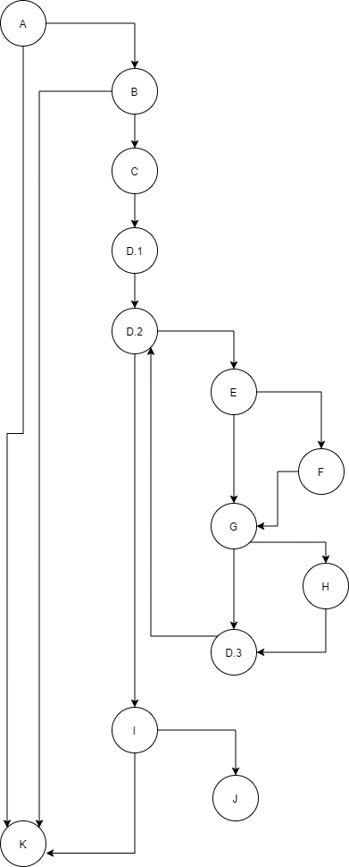

# Втора лабораториска вежба по Софтверско инженерство
## Никола Петровски, бр. на индекс 173089
### Група на код:
Ја добив групата на код 1

### Control Flow Graph

### Цикломатска комплексност
Цикломатската комплексност на овој код е 7, истата ја добив преку формулата P+1, каде што P е бројот на предикатни јазли. Во случајoв P=6, па цикломатската комплексност изнесува 7.

### Тест случаи според критериумот Every path
1. user == null - патека: A-K враќа false

2. user.getUsername == null (останатите параметри се било какви) - патека: A-B-K враќа false

3. user.getEmail() не содржи ни '@' ни '.' - патека: A-B-C-D1-D2-E-G-D3-D2-I-K враќа false

4. user.getEmail() има само '@', но не и '.' - патека: A-B-C-D1-D2-E-F-G-D3-D2-I-K враќа false

5. user.getEmail() има само '.', но не и '@' - патека: A-B-C-D1-D2-E-G-H-D3-D2-I-K враќа false

6. едно од сценаријата кога user.getEmail() е валиден email - патека: A-B-C-D1-D2-E-F-G-D3-D2-E-G-H-D3-D2-I-J враќа true

### Тест случаи според критериумот Every branch
1. user == null - гранки: <b>А-К</b>

2. user.getUsername() == nikola, user.getEmail() == nikola@finki.mk, AllUsers да не го содржи "nikola" - гранки: <b>A-B</b>, <b>B-C</b>, <b>C-D1</b>, <b>D1-D2</b>, <b>D2-E</b>, <b>E-F</b>, <b>F-G</b>, <b>G-H</b>, <b>G-D3</b>, <b>H-D3</b>, <b>E-G</b>, <b>D3-D2</b>, <b>D2-I</b>, <b>I-J</b>

3. user.getUsername() == null (останатите параметри се било какви) - гранки: A-B, <b>B-K</b>

4. user.getUsername() == nikola, user.getEmail == nikola@finki, AllUsers да не го содржи "nikola" - гранки: A-B, B-C, C-D1, D1-D2, D2-E, E-F, E-G, F-G, G-D3, D3 -D2, D2-I, <b>I-K</b>

### Објаснување на напишаните unit tests
<b>Every path</b>
 

Тест 1: Се проверува дали функцијата терминира односно враќа false, кога user==null. Tестот ја поминува патеката А-К.
  
Тест 2: Во овој случај се проследува објект од User, но барем еден од податоците е null. Tестот ја поминува патеката А-B-К.
  
Тест 3: Сите податоци се внесени за User, со тоа што email-от не е валиден и воопшто не содржи '@' и '.'. Во овој случај нема да влезе внатре во условите кои се наоѓаат во циклусот. Тестот ја поминува патеката A-B-C-D1-D2-E-G-D3-D2-I-K.
  
Тест 4: Повторно не е валиден email-от, меѓутоа содржи '@'. За разлика од претходниот тест, тука дополнително ќе влезе во условот кој проверува дали има карактер '@' во email-от. Тестот ја поминува патеката A-B-C-D1-D2-E-F-G-D3-D2-I-K.
  
Тест 5: Тука ќе влезе во условот кој проверува дали има карактер '.' во email-от, но нема да влезе во другиот услов. Тестот ја поминува патеката A-B-C-D1-D2-E-G-H-D3-D2-I-K
  
Тест 6: Во овој случај email-от е валиден и се е подесено за функцијата да врати true. Пример за можна патека е A-B-C-D1-D2-E-F-G-D3-D2-E-G-H-D3-D2-I-J. Оваа патека е ако во email-от '@' и '.' се еден до друг. За сите други случаи патеката ќе се зголеми бидејќи функцијата ќе го изврши циклусот повеќе пати.
   
<b>Every branch</b>
 

Тест 1: Се изминува гранката А-К кога условот во А не е исполнет односно user==null и функцијата враќа false.
  
Тест 2: Овој тест ги опфаќа сите гранки кога функцијата враќа true. Гранките се: A-B, B-C, C-D1, D1-D2, D2-E, E-F, F-G, G-H, G-D3, H-D3, E-G, D3-D2, D2-I, I-J
  
Tест 3: Ќе помине на првиот услов, но ќе падне на вториот, во јазол B така што барем еден од параметрите нема да го исполнува. Гранката B-K се додава во гранките кои досега се изминати и функцијата враќа false.
  
Тест 4: Овој тест случај ја изминува и гранката I-K, а тоа се случува кога email-от не е валиден и функцијата ќе излезе т.е ќе врати false после проверката на условот кој проверува дали email-от e во валидна форма.
